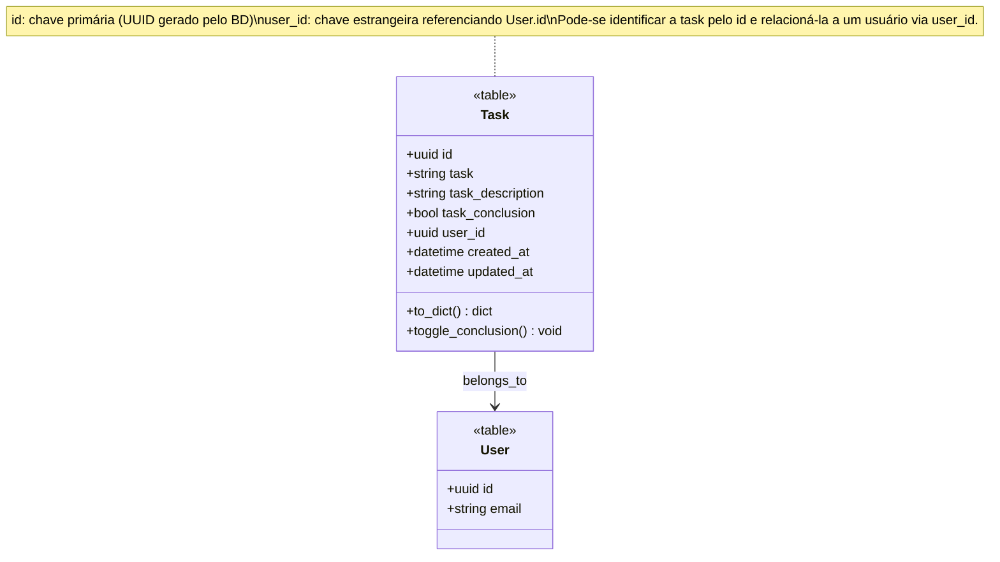

As tasks são as entidades representadas dentro da aba de todo, em que cada uma das tarefas pode ser entendida como um registro dentro da tabela, ou seja, uma instância da entidade. Temos também, que elas podem ser usadas de outras formas, como por exemplo dentro do dashboard principal, como uma forma de ser um dado a ser processado com o objetivo de alimentar o analytics do nosso dashboard

## Diagramação

Temos que sua representação dentro do diagrama de classes, pode ser entendido pela seguinte forma:

## Serviços

Por se tratar de uma entidade que possui a capacidade de ser manipulada diretamente pela interface por meio do usuário, não necessitasse de tantos serviços para abstrair seu uso, Com isso, observa-se que os serviços responsáveis pela sua modificação quase que exclusivamente e diretamente:

- AnalyticsService -> Serviço de Analytics do dashboard
- TaskService -> Serviço de Gerenciamento de Tasks