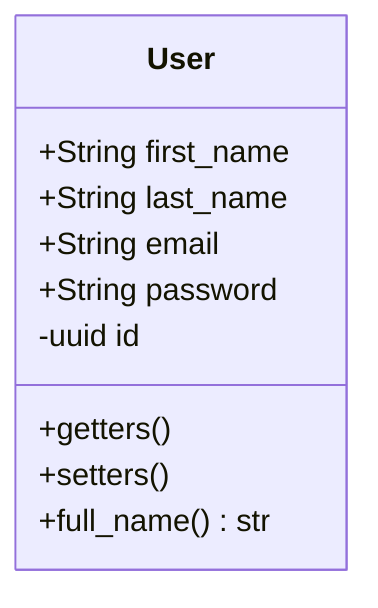

# User

Essa entidade é responsável por representar os usuários dentro do banco de dados, de forma que ela pode ser usada
e manipulada, para modificar os dados de um determinado usuário por meio da api, sem a necessidade de acessar uma 
interface gráfica, ou em outros casos, adquirir dados para que os mesmos sejam usados em diferentes contextos os quais
essas informações de identificação sejam úteis.

## Diagrama

Temos que o comportamento dessa entidade é responsável por ditar a forma como o usuário pode se comportar
dentro do sistema, com isso, temos que o seu entendimento pode ser dado pelo seguinte diagrama:

Com isso, valer ressaltar que dentro do nosso banco de dados, o uuid e o email são chaves únicas, sendo o email um valor de campo único comum, e o uuid é uma chave primária auto-gerada pelo banco de dados, fazendo com que a identificação possa ser feita tanto pelo email, como pelo uuid quando desejamos buscar um usuário dentro do banco de dados da nossa aplicação.

---

## Serviços
Temos que a entidade de usuário possui um serviço especificamente designado para ela, mas outros serviços também possuem acesso a dados de sua tabela dentro do banco de dados, e podem modificar o comportamento de forma direta, ou indireta dos seus dados dentro do banco de dados, como por exemplo:

- AuthService -> Serviço de Autenticação
- UserService -> Serviço de Gerenciamento dos Usuários
- TaskService -> Serviço de Gerenciamento de Tasks

