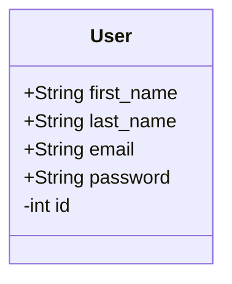

# User

Essa entidade seria responsável por representar os usuários dentro do banco de dados, de forma que ela pode ser usada
e manipulada, para modificar os dados de um determinado usuário por meio da api, sem a necessidade de acessar uma 
interface gráfica, ou em outros casos, adquirir dados para que os mesmos sejam usados em diferentes contextos os quais
essas informações de identificação sejam úteis.

## Diagrama

Temos que o comportamento dessa entidade é responsável por ditar a forma como o usuário pode se comportar
dentro do sistema, com isso, temos que o seu entendimento pode ser dado pelo seguinte diagrama:

Com isso, podemos observar como esses dados são os únicos a serem armazenados dentro do banco de dados, e os restantes funcionam como 
um conjunto de métodos virtuais os quais utilizam dessas informações e de outras informações, para conseguirmos informações específicas. 
outra forma de conseguir as informações, é por meio de chaves estrangeiras as quais possuem informações desse banco de dados como valor respectivo.
