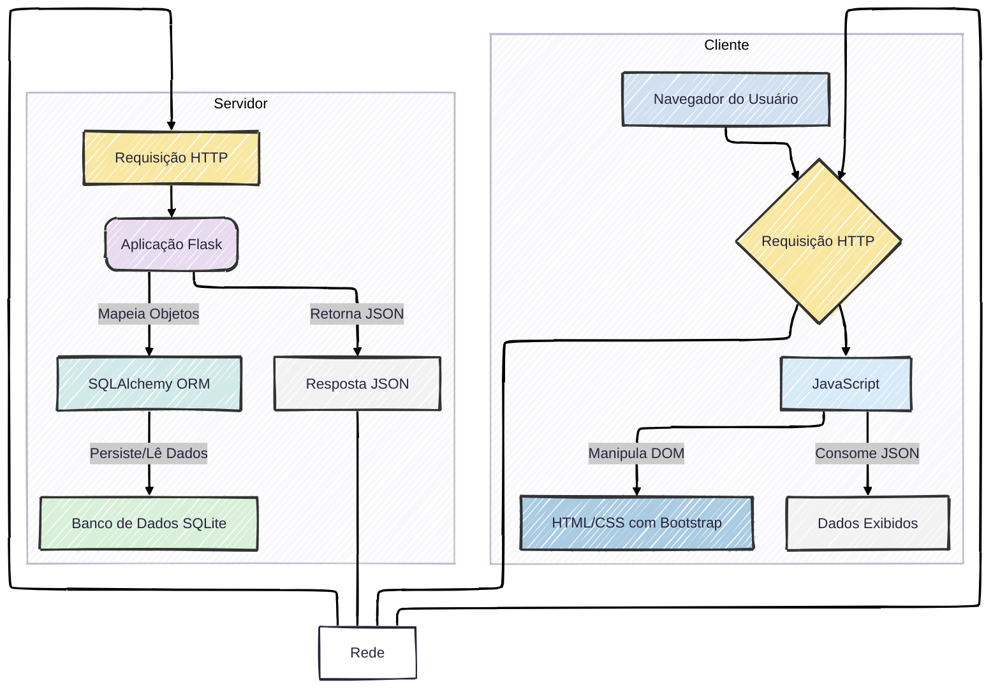

# VTasks API

Essa Api tem como intuito, ser um meio de comunicação entre possíveis desenvolvedores que desejem modificar
a interface do app, criando novas customizações, ou pessoas que desejam criar novas visualizações com os seus dados, 
de forma que possa ser mais agradável a cada gosto.

O Vtasks é construido tendo em vista que a aplicação central não é servida de uma Api, mas sim por meio de um servidor web
que é responsável por gerar as páginas dinâmicas do site, que é o Flask. Com isso, essa Api é desenvolvida lado a lado desse 
servidor, com o intuito de promover um acesso mais estruturado e facilitado desses dados, de forma que eles consigam ser vistos por qualquer um e serem consumidos por qualquer código.

No geral, todos os endpoints podem ser consultados e seu uso pode ser descrito dentro da parte dos mesmo, mas dentro da aba
de entidades, existem um manual simples e direto da forma como as entidades são construídas, e como podemos consumir os 
dados delas. Também haverá um conjunto de diagramas desenvolvidos usando o mermaidjs para que tenhamos uma visualização das relações e da forma como pode ser dado o comportamento dessas entidades.

# Contexto Técnico
Referente ao contexto técnico, irei me debruçar sobre as tecnologias que foram utilizadas, e alguns detalhes que podem ser 
necessários de serem comentados com o intuito de serem mais veementemente entedidos. Com isso, temos que por hora, a listagem de tecnologias que foram usadas desde o desenvolvimento inicial da aplicação, são:

- Python
- Flask
- HTML
- CSS
- Bootstrap
- Jinja
- Javascript
- SQLAlchemy
- MySQL ou SQLite

Em relação a essas tecnologias que foram mencionadas, haverão elementos específicos em cada uma das partes quando necessário,
mas por hora pode ser entedido principalmente que o comportamento da nossa aplicação web, sem constar o funcionamento da api 
sendo colocada em paralelo, pode ser entendida por:

## Relação Entre a Aplicação e API
Nesse caso, temos que a aplicação já foi construída tendo em vista as necessidades que uma API futura poderia vir a apresentar.
Com isso temos que todo o funcionamento da nossa aplicação e da API, são construídos de forma que utilizam os 
mesmos serviços, e ferramentas de consultas, atualização, e deleção de dados dentro do banco de dados, e de 
processamento de informações dentro do sistema. Isso facilita a forma como as implementações dentro da aplicação e seu 
comportamento dentro da API conversam, pelo fato de serem exatamente a mesma aplicação.